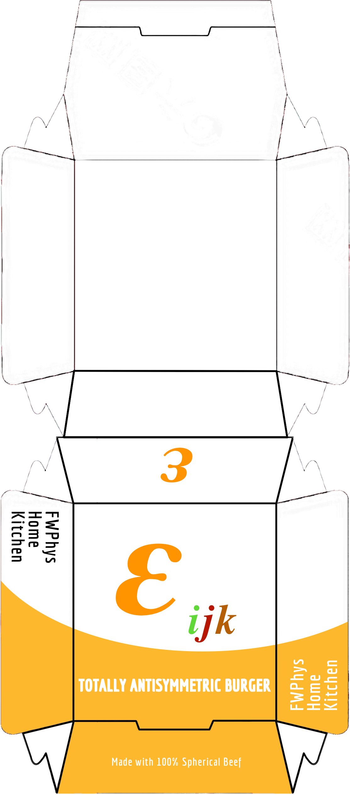

# TABurger
3D Levi-Cevita Hamburger Recipe 

The wrapping art is supplied. The final product looks like this:

Recipe: we are visualizing the Levi-Cevita symbol in 3D, $\epsilon_{ijk}$. It has the following properties:

$\epsilon_{123} = \epsilon_{231} = \epsilon_{312} = 1;$ (even permutations preserve sign)

$\epsilon_{213} = \epsilon_{132} = \epsilon_{321} = -1;$ (odd permutations change sign) 

$\epsilon_{112} = ... = 0.$ (repeated indices give zero.)

Take your favourite bread slices (x2), cherry tomato ("C", for +1), pickles ("P", for -1), and meat or vegitables, whatever that goes into your regular sandwich. 

We lay a piece of bread inside the plate first, and proceeed to build the first layer.

 -  C  -
 P  -  -
 -  -  -

Separate with a piece of the dividers, then

 -  -  P
 -  -  -
 C  -  -
 
 Add another, we are getting there,
 
 -  -  -
 -  -  C
 -  P  -
 
 Top off with the second piece of bread, and we are done!
 
Make sure you are careful if you eat two such sandwiches in quick succession, as the products of Antisymmetric Sandwiches are frequently made undergraduate physics assignment questions and people cry about it.
